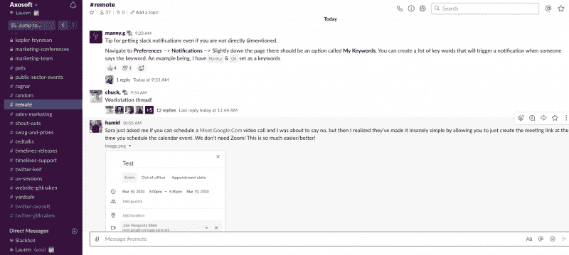

# 远程开发团队的最佳工具

> 原文：<https://www.gitkraken.com/blog/best-tools-remote-dev-teams>

本周早些时候，我们组织做出了一个重大决定。从周一到周二， [Axosoft](https://www.axosoft.com/) 一夜之间从一家面对面的公司转变为一家完全远程办公的公司。我们组织的领导层认为，在我们努力将冠状病毒疫情的影响及其对我们团队成员的影响降至最低的过程中，这是一项必要的先发制人的措施。

> 从明天开始，我的公司，Axosoft，将会在另行通知前关闭。这并不是因为我担心感染 [#COVID](https://twitter.com/hashtag/COVID?src=hash&ref_src=twsrc%5Etfw) 病毒，而是为了防止大规模[#冠状病毒爆发](https://twitter.com/hashtag/CoronavirusOutbreak?src=hash&ref_src=twsrc%5Etfw)，我们不得不采取比平常更极端的措施。
> 
> 我们的内部公告:[pic.twitter.com/USrwy3Acta](https://t.co/USrwy3Acta)
> 
> —哈米德·肖耶伊(@哈米德)[2020 年 3 月 9 日](https://twitter.com/hamids/status/1237139693914828800?ref_src=twsrc%5Etfw)

 <picture decoding="async" class="wp-image-3360" title="<script>"></picture> window.addEventListener('DOMContentLoaded', function() {

在完成这一关键转变后的几个小时里，我们发现了哪些目前由我们支配的软件工具将最终帮助我们实现远程成功。

无论您是一个正在考虑向远程工作过渡的开发团队，还是一个分布式团队的新员工，或者，也许您就像我们这些正在应对新冠肺炎公共健康危机的 Axosoft 员工一样，本文都将帮助您充分利用新的远程工作环境。

## 团队在做什么？

无论您的软件开发团队是在同一个房间一起工作，还是位于世界各地的家庭办公室，拥有一个向您展示您的团队成员所做工作的工具是至关重要的。

GitKraken Git GUI 是在团队协作的基础上构建的。我们的中央提交图允许开发团队中的每个人，从产品经理到初级开发人员，查看在任何给定的时间点谁对哪些文件做了什么更改。

***下载 GitKraken Git GUI，[连续四年排名第一的开发者工具](https://blog.axosoft.com/top-developer-tools-2020/)，今天免费。***

## 沟通是远程成功的关键！

当您的开发团队不在同一个地方时，沟通工具在参与、责任和生产中起着关键的作用。

### **Slack:远程团队的实时通信**

Slack 是一个实时消息工具，被许多团队用作电子邮件的替代品，用于更快、更不正式的内部交流。该工具在【2020 年前 20 名开发者工具列表中排名第 13。

 <picture decoding="async" class="wp-image-3366"></picture> 

*Axosoft started a #remote channel in Slack to discuss best practices for the transition.*

Slack 团队继续开发这款工具，以包括更多功能来帮助远程团队，如搜索和归档功能，并提供与谷歌日历和 Glo 发布板等应用程序的无数集成,让您组织会议和任务。看看 [Slack 如何与 Glo 发布板](/blog/update-task-issue-glo-cards-slack)集成进行任务跟踪。

### **Google Meet:远程团队的会议和电话**

即使是远程团队也需要召开会议和电话会议。令人欣慰的是，现代技术为此提供了许多解决方案，使得创建动手协作的数字空间变得容易且负担得起。

Google Meet 是一款价格实惠的网络会议工具，为团队安排和执行视频和语音通话提供了一个可访问的平台。用户可以简单地安排一个会议并分享链接。就这么简单！

## **远程团队的项目管理**

当您的开发团队远程工作时，责任可能更难实现。这就是项目管理工具可以发挥作用的地方，保持单个团队成员跟踪他们的个人任务，以及他们如何影响更大的项目里程碑和目标。

### **Glo 问题板:任务&问题跟踪**

Glo 发布板允许远程开发团队在看板上可视化他们的项目任务；该工具还提供仪表板、[日历](https://support.gitkraken.com/glo/calendar/)和时间线视图。

例如，项目经理可以为他们的团队在即将到来的发布中需要完成的每项任务创建一个看板。每张卡都可以分配给一个单独的开发人员，并且可以添加标签来提供额外的上下文，以及卡描述和评论部分。

创建一个板后，很容易将您的团队成员添加为其他板用户。您甚至可以将您的讨论板组织成组，也许是针对您组织内的不同部门或工作组。组织的所有者和管理员可以在 Glo 中创建[团队并分配用户。](https://support.gitkraken.com/glo/teams/)

***注册 Glo 发布板，增强远程项目管理。***

专为软件开发团队设计的 Glo 发布板继续增加新功能，如[拉请求自动化](/blog/github-pull-request-integration-glo)，使该工具更加健壮和有价值。Glo 现在通过 [Glo Marketplace](https://www.gitkraken.com/glo-marketplace) 与 [Slack](https://support.gitkraken.com/glo/integrations/slack/) 、 [Google Calendar](https://support.gitkraken.com/glo/integrations/calendar-feeds/) 、 [GitHub Issue Sync](https://support.gitkraken.com/glo/integrations/github-sync/) 、 [GitHub Actions](https://support.gitkraken.com/glo/integrations/github-actions/) 等进行整合。

## **优化远程团队的工作效率**

使用这些工具，您一定可以通过增强的协作、沟通和项目管理来优化远程开发团队的生产力。

您的远程开发团队利用哪些工具或策略来取得成功？使用 [@GitKraken](https://twitter.com/GitKraken) 和# RemoteWorking 标签在 Twitter 上告诉我们，分享你的最佳实践。